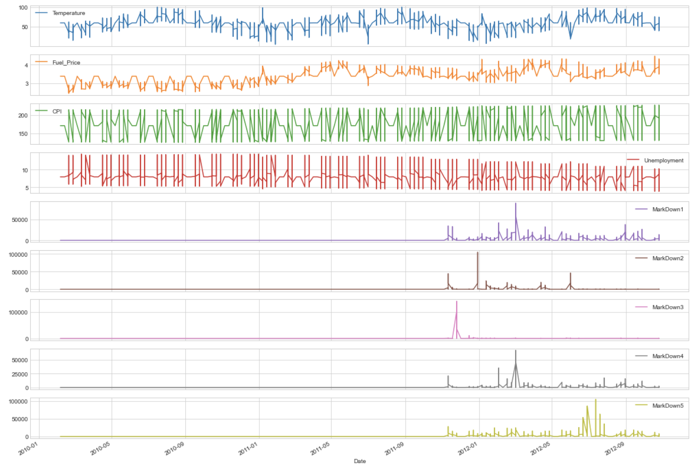
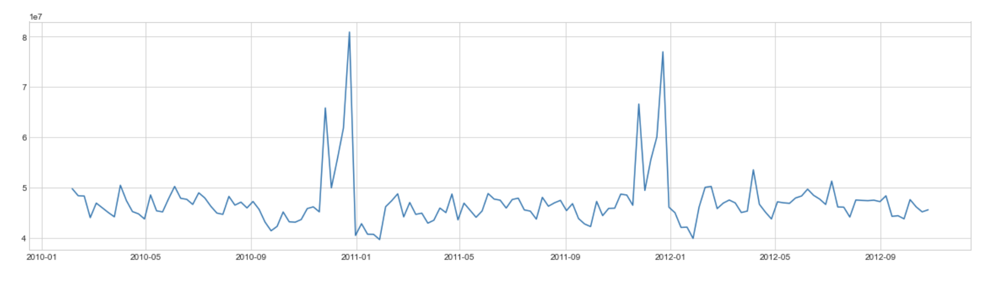
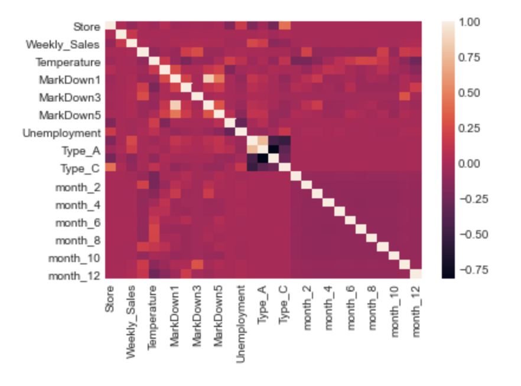

- # Machine Learning Engineer Nanodegree

  ## Capstone Report

  Olle Green

  *olleg.green@gmail.com*

  July 12th, 2020

  ## I. Definition

  _(approx. 1-2 pages)_

  ### Project Overview

  #### Problem domain

  Being a Master student in Operations Management at Stockholm University, the academic litterature has showed that the supply chain is an important part of orgnsations, that not many might know is facing some difficult pressures. As mentioned in the propsal, demand predictions in supply chain managagemnt (SCM) and logistics have historically been a constant pressure to make them more precise (Thomas & Griffin, 1996). The reason for this is due to the fact that inaccurate forecasting results in either too low supply to fulfill the current market demand, or too much, which in turn results in increased holding costs from inventory. Common ways to predict demand in SCM have been statistical models such as the ARIMA model (Jaipuria & Mahapatra, 2014). Academic articles have also tested different modern machine learning algorithms such as XGboost and compared them to more classical linear regressions (Vanichrujee, Horanont, Pattara-atikom, Theeramunkong, & Shinozaki, 2018). This is still a new concept of using more advanced machine learning algorithms to predict demand over classical statistical models such as linear regressions, which is a domain we would like to explore further in this project.
  
The key area of interest is: As an organisation grow larger, the more vital the precision in these predicitons become. Therefore, we will explore the possibility to utilise Machine Learning algorithms to predict the demand of certain products, in order for the SCM-team to make better planning for instance purchasing product components for an upcoming season. 
  
In this case, we will take a look at Walmart, the largest retailer in the US and use their data, which has been provided on kaggle.com in order to predict future demand of their sales. 
  

  
#### Problem origin
  
The broader demand forecasting prediciton problem has been studied for decades by academics and professionals (Suganthi & Samuel, 2012), however the the utlisation of Machine Learning algortihms for this purpose is a more recent phenomenon that academics still explore to this date (Carbonneau, Laframboise, & Vahidov, 2008) (Law, 2000). 
  
This specific demand forecasting problem for Walmart originated from kaggle.com and their demand forecasting predicition competition. See link to the competition [here](https://www.kaggle.com/c/walmart-recruiting-store-sales-forecasting/overview). 
  
As we have the opportunity to utilise more modern algorithms, we would like to test how good results we can get from these compared to what the general forecaster uses. The general forecaster in this case will be the user "Hari Khanal" on the kaggle competition leaderboards for the Walmart competition, with a prediction score of 3985.79966. Why we chose Hari is because he is close to the median score out of 700 competitors for the Walmart competition. 
  

  
#### Related data sets or input data
  
The data used for this report was given in the kaggle competition by Walmart, which is as follows; 
  

  
##### 1. features.csv
  
Contains data related to the store, department, and regional activity for the given dates.
  
* Store - the store number
  * Date - the week
  * Temperature - average temperature in the region
  * Fuel_Price - cost of fuel in the region
  * MarkDown1-5 - anonymized data related to promotional markdowns. MarkDown data is only available after * Nov 2011, and is not available for all stores all the time. Any missing value is marked with an NA
  * CPI - the consumer price index
  * Unemployment - the unemployment rate
  * IsHoliday - whether the week is a special holiday week
  

  
##### 2. train.csv
  
Historical sales data used for training. Within this tab you will find the following fields:
  
  * Store - the store number
  * Dept - the department number
  * Date - the week
  * Weekly_Sales -  sales for the given department in the given store
* IsHoliday - whether the week is a special holiday week
  

  
##### 3. test.csv
  
Same as train.csv in terms of columns, but instead we don't find the "Weekly_Sales", as this will be our dependent variable we will try to predict future sales in the final submission for the kaggle competition.
  

  
  ##### 4. stores.csv
  
Anonymized information about the 45 stores, indicating the type and size of store. 
  
* The store number (anonomised) 
  * Type 
  * Size
  
  
  
  **Note:** Currently given the data provided in the competition, we do not have any other related data sets or input data that we could or should utilise, to be in alignment with the competition rules at kaggle.com. 
  
  


  ### Problem Statement

  #### What will we solve

We will solve the problem of predicitng future demand for sales of different Walmart stores, based on the provided data by the organsation. We will need to identify what data is helping the models, vs causing worse predicitons and adjust the data accordingly. 

  #### How we will solve it

We will use the data provided in the competition, clean it up so we can use it in our models. Then create demand predictions that are better then our kaggle-competition-benchmark score of 3985.79966. The intended solution will be based on the test.csv dataset for our demand predictions, where our machine learning algortihms will give use results which have taken the different features from the other datasets to give us good predictions of future demand. 


  ### Metrics

In this section, you will need to clearly define the metrics or calculations you will use to measure performance of a model or result in your project. These calculations and metrics should be justified based on the characteristics of the problem and problem domain. Questions to ask yourself when writing this section:

  - _Are the metrics you’ve chosen to measure the performance of your models clearly discussed and defined?_
  - _Have you provided reasonable justification for the metrics chosen based on the problem and solution?_


  **Olle**

Ways to evalute the different models will be the following statistical measures of how accuracy and robustness;

  #### Accuracy:

  * Mean Absolute Error (MAE) - Measure the mean absolute errors. The smaller the number is (closer to 0), the better. 
  * mean Squared Error (MSE) - measures the average of the squares of the errors. The smaller the number is (closer to 0), the better. 
  * Root Mean Squared Error (RMSE) - the square root of the variance, known as the standard error. The smaller the number is (closer to 0), the better. 

  #### Robustness:

  * R-square (R^2) - Model used by academic (Nair & Vidal, 2011) for model robustness. The smaller the number is (closer to 0), the better. 

  ##### Why these metrics?

All of the above metrics assesses the errors between forecasts generated by our machine learning algoritms and compare them to the actual data. The metrics have been used for decades in statistics (C. J. Willmott et al., 1985) and in recent times been used for evaluation of Machine Learning models (Kavsaoğlu, Polat, & Hariharan, 2015). Therefore we will follow the academics and evaluate the machine learning preedictions using these measurements. 

  #### Why multiple metrics instead of one?

We are choosing to not only look at one metric, but multiple as there has been exensive research of flaws of each metric when choosing between for example MAE vs RMSE (Willmott & Matsuura, 2005) (Chai & Draxler, 2014). Therefore, we will assess the final models using all three so we can verify the results. Meaning: instead of only looking at one, we instead look at three metrics to be certain there are not issues with our final results due to the metrics themselves. 

  

  #### Final note

All of these accuracy and robustness metrics will help us to assess which models are providing us with the better demand forecast model before submitting the best one to the kaggle competition to get our actual competition-score.

  

  ## II. Analysis

  ### Data Exploration

  #### Features discussion

The features of the dataset was provided by Walmart for their Kaggle competition. In this case we have not added or removed any of the features but used the same data as everyone else partaken in the competition. The different features are as follows: 

  ##### Store - the store number

This feature will be used for linking each other feature to the parent store to see if any linkage is find such as size etc. 

  ##### Date - the week

The date feature keeps the data in alignment so we compare the correct datapoints to eachother. However, we must note that it is very common that dates are in a string format, which was the case here, where we would change the data type into datetype format (Python Software Foundation, 2002) to handle the complex nature of dates and time. 

  ##### Temperature - average temperature in the region
The reason for including the temperature in this analysis is to see if perhaps we can find a postitive or negative relationship between how much people buy depending on how warm it is that week. For example it could be that on extremely hot weeks, people only buy a limited amount of products which relate to simply making handle the warmth itself. Thereby only buying ice cream. However, with the Data Scientist, Machine Learning Engineer or good old fashioned atatistician approach: we never assume, we test and find statistical significant measurments that indicate as such before any assumptions are made. 

  ##### Fuel_Price - cost of fuel in the region

This feature of cost of fuel in the region will be tested in a similar sense as the "temperature" feature meentioned above. For example it could theeoretically be the case that people don't go to walmart if the fuel price is getting to high as for some the transportation cost might be more. In a sense, this seems unlikely as it seems like walmart is a store you can travel longer distances as you'll still "save" money with the overall low prices they provide on their products. Still, this needs to be tested to verify our hypothesis. 

  ##### MarkDown1-5 - anonymized data related to promotional markdowns. 

This is a pretty straight forward one. Walmart has used 5 different promitional markdowns, we will analyse to see which ones were beneficial for the company and which ones did not assist in sales. The fundamentally inteeresting part about this is that we don't know anything about the promotions by themselves and how theey were executed, instead we will only analyse the data and put no emitions or opinion into the equation of evaluating each promotional markdown. 

  ##### CPI - the consumer price index

  The CPI measures the average price trend for the entire private domestic consumption based on prices consumers actually pay. This can potentially be used for identifying trends to assist in the overall predicitons, but we must test this. 

  ##### Unemployment - the unemployment rate

The idea of Walmart including the unemployment rate is a nice idea. It could the case that with fewer people unemployed, the more money they have, therefore more money can be spent on walmarts products. But it could also be the case that with a high unemployment, people tends to go to target as they have a lower pricing strategy than their competitiors where people will by their essentials at Walmart instead of a more expenisve local store for example. Meaning: as it can be both or eiter or non of these options, this needs to be tested before any assumptions are made. 

  ##### IsHoliday - Whether the week is a special holiday week

This will help to identify when a special occasion occurs where sales might be higher than usual, where it should not affect the overall model and should be interpreted more as more consistent and predictable outliers. 

  ##### Dept - The department number

Similar to the store feature, some departments might have overall higher sales. As this is could be the case, we need to identify if there are such trends which can help us to predicit future demand of a certain department. 

  ##### Weekly_Sales 

The overall sales for the given department in the given store. This will be our dependent variable in this analysis as our target is to predicit future weekly sales.

  ##### The store number (anonomised) 

Anonymized information about the 45 stores, indicating the type and size of store. 


  #### Abnormalities or Characteristics of the Data

  * MarkDown data is only available after Nov 2011, and is not available for all stores all the time. Any missing value is marked with an NA.
  * The test data is not through a full year, but instead it starts in november and ends in july. This needs to be taken into consideration as we split and analyse the time series part of the dataset. 
  * It is a rather big dataset overall, with over 400 000 datapoints, but it is still only from a time perspective 3 years. It would be beneficial to have more data in order to verify the regressions results over not only these years, but longer time frames. But as this is what we have to work with, we will simply take this into consideration when we dive deeper into the analyis.  


  ### Exploratory Visualization

  In this section, you will need to provide some form of visualization that summarizes or extracts a relevant characteristic or feature about the data. The visualization should adequately support the data being used. Discuss why this visualization was chosen and how it is relevant. Questions to ask yourself when writing this section:

  - _Have you visualized a relevant characteristic or feature about the dataset or input data?_
  - _Is the visualization thoroughly analyzed and discussed?_
  - _If a plot is provided, are the axes, title, and datum clearly defined?_

_______

  #### General Plot for features

Before heading down the rabbithole of I prefer to get a general overview of features, which I find difficult if it's one graph by itself. Therefore I used the subplots=True function in matplotlib to get a general sense of the data, and most importantly: ***seeing them in the same timeframe***. In this way we can get a general grip on if there is a certain way we should look at specific features and how they have been used or acted over the given weeks.



  

  #### Insights from the graph

  - **Temperature**: it seems like it is decently seasonal, which sounds reasonable when we talk about temperature on a YoY basis.
  - **Fuel Price**: We find a slight positive trend overall.
  - **Discounts**: We have a few spikes, but not too many to make assumptions of the affects of it. It seems like the discounts are a more recent thing appearing in the end of 2011 with the exception of the potential test of 2011-02 where we find a small bump on all discount levels.
  - **Unemployment**: Seems to have a slight negative trend over this timeframe.
  - **Markdown 1-5**: We can see that the data for the different markdowns indicates that they have not been used a lot overall. We find some larger spikes in for example MarkDown3, but it will be difficult to extract time series insights from this. Although, with enough evidence from different stores, we might see some statistically significant results, which could be beneficial in our models to address to get better forecasts.


  #### Weekly Sales Plot

Here we simply plotted the weekly sales over the time period to gain insights of possible seasonality, or general positive / negative trends in sales.



#### Insights

  - **Seasonality - \*High-Point\***: It seems there are some seasonality to our data, where the end of December seems like a popular time to buy our company's specific products. Hy theory is that this has to do with the holidays and people buy gifts for each other, which seems reasonable.
  - **Seasonality - \*Low-Point\***: Around the end of january it seems to be a pretty steep dip in the different stores sales both during 2011 and 2012.

  #### Correlation Heat Map

The correlation heat map gives us a general overview of the correlation between the different features presented in the dataset. 

**Notes:** To verify that the dummy variables were set up correctly I included them in the correlation table below. The different types of stores and the different months are from an analysis perspective to be ignored. 



#### Insights

* We can see that the different correlations are not that significant (ignoring the dummy variables and the MarkDowns being correlated to each other).
* For a more clear and important overview to get to our final model, we can see that we need to specifically see the correlation between ***Weekly_Sales*** and the other features to find out what is important when we predict future sales. 
* In order to do this, we continue the plotting with a correlation plot with the sales being the constant feature against each other feature. 

  #### Correlation Plot

In order to analyse the correlations of sales we use the bar chart from matplotlib to be able to get a quick overview of what correlates with the weekly sales at Walmart, given the set of features in the dataset. 


#### Key Insights

  - **MarkDowns**: Not that significant in terms of weekly sales from what we might initially expect, but it's still showing a positive correlation. This indicates that their promotional efforts seems to bring in revenue, but not to as a large scale as other parameters such as size. 
  - **Size**: Highest correlation of all, telling us that having a larger store = more sales. Only thing to notice is that this could imply that having larger stores will automatically increase revenues, but it could be linked to the location and being situated where a lot of people are, and therefore it results in higher revenue. In short, we can apply the old saying "Correlation is not causation". But it will b
  - **Type**: Type_A have a positive correlation with the weekly sales. As we have not been given the information of what type of store there are, we can only extract that being the Type A store, it will have a positive correlation with the weekly sales. 
  - **Department**: We find a positive correlation with sales as well. In a similar fashion to the type of store, we don't know the specific details of what these departments are. But we should note that they are correlated positively with weekly sales. 

  


  ### Algorithms and Techniques


#### What kind of problem are we dealing with?

With the different features sets provided, we want to see if we can extract the useful information from these features to predict a nominal value, in this case the future sales. Therefore, this shall be classified as a ***Regression problem*** where we have the "Weekly_Sales" to be the dependent variable we are trying to predict, and the other features will be our independent variables.

#### What models should we consider? 

As we try to predict a nominal number we move away from models such as logistical regressions and consider other models such as linear regressions. However, the overall data seems to indicate that there is **not**  linearity in this dataset. My hypothesis therefore become that a linear regression model would **not** be optimal here. But to be sure, we will include two linear model to verify our hyptothesis.

##### The models we chose to take a look are as follows:

* **Linear Regression** (Linear model) - Classic old statistical model that has been a common model to use in Machine Learning. We are as before including this to verify our hypothesis of this not being a linear problem to solve. 
* **KNeighborsRegressor** (KNN) (neighbors model) -  KNN is a model that can be used for both classification and regression predictive problems (analyticsvidhya, 2019). It is widely used for forecasting in academia and studies (Zhang, Liu, Yang, Wei, & Dong, 2013), which is why we chose to include it in this project. 
* **Decision Tree Regressor** (Tree model) - This model is used to fit a sine curve with addition noisy observation. Thereby it learn local linear regressions instead of pure linear regression for the overall data (scikit-learn.org, 2019), which should in theory work better for our dataset than regular linear regression models.
* **Random Forest Regressor** (Enemble model) - The RFR ensamble model is one of the more popular machine learning models due to its good or even excellent performance across both classification and regression predictive problems (Brownlee, 2020). Due to it's popularity and positive feedback from the machine learning engineer community, we include it in our samples of models. 
* **Extra Trees Regressor** (Ensemble model) - Expanding on the ensemble models such as the Random Forest Regressor above, we are now considering the Extra Trees Regressor. This is because it is a widely used random forest algorithms and can often as-good or sometimes even better performance than the random forest algorithm, while using simpler algortihms for processing (Brownlee, 2020b). With these reasons, we find it as an obvious choise to include for our sales forecasting problem.
* **XGBoost** (gradient boosted decision trees) - The go-to model for many kaggle competition competitors, XGboost has been over the year become a fan favorite due to the accuracy it provides, while being consistently fast (analyticsvidhya, 2018). Therefore we will include XGboost in our model-arcenal. 
* **Ridge** (Linear model) - This is another linear model we will apply to test our hyptohesis of this dataset not having purely a linear linear problem to deal with.
* **Lasso** (Linear model) - Same as above, a linear model we will apply to test our hyptohesis of this dataset not having purely a linear linear problem to deal with.


  ### Benchmark

**How will we choose the optimal model before the final benchmark?**

* The initial benchmarking will be made by looking at three different metrics we have mentioned earlier to determine accuracy by calculating the estimation errors, as well as one statistical measure that represents the proportion of the variance for a dependent variable that's explained by an independent variable or variables in a regression model, which will tell us the robustness of our models. These are: 

**Error Metrics:**
1. Mean Absolute Error (MAE)
2. Mean Sqared Error (MSE)
3. Root Mean Squared Error (RMSE)

**Model Valuation Metric *(robustness of the model):***

1. R-squared (R^2)

### Final Comparison Benchmark

The final benchmark after selecting our best model will be to use it and compare it to roughly the 50th percentile score of the Walmart Kaggle Competition the data has originated from, which seems to be around **4000 points** on the kaggle leaderboards. You'll find the link to the scoreboard [here](https://www.kaggle.com/c/walmart-recruiting-store-sales-forecasting/leaderboard).  A competitor close to this score that we will try to beat is "Hari Khanal", with the score of **3985.79966**.

* **GOAL:** Get a lower score than Hari. 
* The lower the score, the better the prediction.


____________________


  ## III. Methodology

  ### Data Preprocessing

In this section, all of your preprocessing steps will need to be clearly documented, if any were necessary. From the previous section, any of the abnormalities or characteristics that you identified about the dataset will be addressed and corrected here. Questions to ask yourself when writing this section:

  - _If the algorithms chosen require preprocessing steps like feature selection or feature transformations, have they been properly documented?_
  - _Based on the **Data Exploration** section, if there were abnormalities or characteristics that needed to be addressed, have they been properly corrected?_
  - _If no preprocessing is needed, has it been made clear why?_

**Olle**

#### Preprocessing steps

For each feature we will verify if they are ok as they are provided, or if some feature engineering was needed in order to use them in our machine learning algortithms. 

##### Features 

- **Store** (the store number) - This is correctly formatted from the original dataset provided by Walmart. 
- **Dept** (the department number) - This is correctly formatted from the original dataset provided by Walmart. 
- **Date** (for the analysis) - This needed to be formatted into a date format in order to merge the datasets correctly and then be read during data visualisation to get the graphs looking correct. Here we used *datetime* function in Python seen in the jupyter notebook. 
- **Date** (set up for model input) - After the visualisation was completed, we created dummy variables for each month in order to provide our regression models to pick up historical trends. They were split into month_1	month_2	month_3	month_4	month_5	month_6	month_7	month_11	month_12, representing each month of the year where if it was the month, the value in that column would be equal to one, and the rest of the columns be equal to zero. 
  - *Example*: If a datapoint is from January, the column **month_1** would be equal to **1** and the columns **month_2-month_12** would all be equal to zero. 
- **Temperature** (average temperature in the region) - Had to process 138 586 NaN-values. As we are doing a regression analysis, these values were replaced with the mean of the total dataset. This is because we looked at the overall value from the graph and saw that the temperatures were seasonal, but did not have an overall positive or negative trend year over year (YoY).  
- **Fuel_Price** (cost of fuel in the region) - The fuel price had the same issue as the temperature feature. where we had to process 138 586 NaN-values. As we are doing a regression analysis, these values were replaced with the mean of the total dataset. Although we found a slight decline in the overall data, it is not significant enough to show any larger results by using the mean.  
- **MarkDown1-5** (anonymized data related to promotional markdowns) - As MarkDown data is only available after * Nov 2011, and is not available for all stores all the time, the other missing value is marked with an NA. This had to be dealt with where we simply exchanged them into 0s (zeros) in order to be processed in both graphs and our forecasting models. 
- **CPI** (the consumer price index) - The CPI was in the same position as the temperature where we had to once again replace 138 586 NaN values. As we are doing a regression analysis, these values were replaced with the mean of the total dataset. This is because we looked at the overall value from the graph there is not a big enough trend for us to use something different than the mean of the overall CPI-data.  
- **Unemployment** (the unemployment rate) - The unemployment had the same issue as previously described features where we had 138 586 NaN values we had to deal with. In a similar fashion, the difference is not substantial enough to not simply use the mean as a replacement of the NaN-values. 
- **IsHoliday** (whether the week is a special holiday week) - The answer provided for this feature of wheter there is a holiday or not during this date was represented with a string of either **False** or **True**. We replaced this with setting the False-values to zero, and making the True-values into ones so we can process the data in our models.

- **Weekly_Sales** (sales for the given department in the given store) - This feature was set up and ready for use in our models, so no action was needed for this one. 

- **The store number** (anonomised) - This feature was set up and ready for use in our models, so no action was needed for this one. 
- **Type** - There were three types of stores, being:
  - Type A
  - Type B
  - Type C
    - To set this up correctly for both visualisation and be processed in our machine learning modeels, we created dummy variables for each type in the same way as we did with the date/months earlier. So if a datapoint is a Type_A, it would be equal to 1, and the  Type_B and Type_C columns would be equal to zero. 
    - This is in order for our models to pick up on this feature being significant or not in contributing to our dependent variable = Weekly_Sales.
- **Size** - This feature was set up and ready for use in our models, so no action was needed for this one. 


##### Fixing Abnormalities & Characteristics

* There were multiple NaN values that needed to be dealt with for different features. For this we used a few different ways of dealing with them, which are explained both above and as a consise reminder below as well.
  * **Markdown1-5** - we replaced the NaN-values and replaced them with 0s (zeros) in order to be processed in both graphs and our forecasting models.
  * **Temperature** (average temperature in the region) - Had to process 138 586 NaN-values. As we are doing a regression analysis, these values were replaced with the mean of the total dataset. This is because we looked at the overall value from the graph and saw that the temperatures were seasonal, but did not have an overall positive or negative trend year over year (YoY).  
  * **Fuel_Price** (cost of fuel in the region) - The fuel price had the same issue as the temperature feature. where we had to process 138 586 NaN-values. As we are doing a regression analysis, these values were replaced with the mean of the total dataset. Although we found a slight decline in the overall data, it is not significant enough to show any larger results by using the mean.  
  * **MarkDown1-5** (anonymized data related to promotional markdowns) - As MarkDown data is only available after * Nov 2011, and is not available for all stores all the time, the other missing value is marked with an NA. This had to be dealt with where we simply exchanged them into 0s (zeros) in order to be processed in both graphs and our forecasting models. 
  * **CPI** (the consumer price index) - The CPI was in the same position as the temperature where we had to once again replace 138 586 NaN values. As we are doing a regression analysis, these values were replaced with the mean of the total dataset. This is because we looked at the overall value from the graph there is not a big enough trend for us to use something different than the mean of the overall CPI-data.  
  * **Unemployment** (the unemployment rate) - The unemployment had the same issue as previously described features where we had 138 586 NaN values we had to deal with. In a similar fashion, the difference is not substantial enough to not simply use the mean as a replacement of the NaN-values. 
  * **IsHoliday** (whether the week is a special holiday week) - The answer provided for this feature of wheter there is a holiday or not during this date was represented with a string of either **False** or **True**. We replaced this with setting the False-values to zero, and making the True-values into ones so we can process the data in our models.


  ### Implementation

#### Process for which metrics and algorithms were implemented

As we stated earlier, after some intial visualisation we set up the hypothesis where the use of a linear regression problem will not be optimal here as the data seems to indicate non-linearity. Therefore, we used a multitude of popular machine learning algorithms, including linear regression models to test our hypothesis. All models are specified in more detail in the earlier section, but below we find a reminder of them:

* **Linear Regression** (Linear model)
* **KNeighborsRegressor** (KNN) 
* **Decision Tree Regressor** (Tree model) 
* **Random Forest Regressor** (Enemble model) 
* **Extra Trees Regressor** (Ensemble model)
* **XGBoost** (gradient boosted decision trees) 
* **Ridge** (Linear model) 
* **Lasso** (Linear model) 

Most of these models were imported from the Scikit-Learn library, with the exception of XGBoost, which we had to use ''pip install xgboost'' in our local virtual environment to use. 

We then chose three different accuracy metrics (specified in the earlier section) as well as a model evaluation metric for the models robustness (see earlier section for a longer description). 

So the final process to use our model was to take our train and test data and split it out so that the Weekly_Sales were our train_y and the other features were put in a train_X dataframe. We then split the data so we had 80% of the data to train on, and the other 20% saved in a validation/test dataframe. Which we then could use to compare our training and test data and produce our performance metrics for each machine learning model specified above. 

#### Complications during the coding process

* **Virtual Environemnt complications** - In short the Scikit-Learn library took me a full day to get to work on my virtual environment from Anaconda (conda). This was a faulty mistake that could be avoided if I would have used for example **google colab** or the notebook instances from **AWS Sagemaker**. But as of this project, having done two projects using cloud computing, it felt like a beneficial practice to do this sort of project locally where I connected my github-reposatory to my local laptop, and pushed updates to the repo. An overall learning curve that increased the project time a lot. 
* **Formatting of the results output** - I wanted something easily readable and spent some hours on just making it clear for the reader what model comes up next, and what was the performance of that model in plain text. Turned out pretty good in my opinion. 
* **0.99% R-square** - A pure mistake that took me hours as well, where the R-square of the models was close to 1.0. In practice, having a model with such a high value should raise some red flags, which it did in my case. The obvious problem was that I used the training data instead of the test data for the calculation, resulting in comparing the training data to the training data instead of the test data. An obvious but small enough error for me to spend hours on thinking that the hole model was set up incorrectly and adjusting hyperparameters etc. In the end it worked out.  

  ### Refinement

  In this section, you will need to discuss the process of improvement you made upon the algorithms and techniques you used in your implementation. For example, adjusting parameters for certain models to acquire improved solutions would fall under the refinement category. Your initial and final solutions should be reported, as well as any significant intermediate results as necessary. Questions to ask yourself when writing this section:

  - _Has an initial solution been found and clearly reported?_
  - _Is the process of improvement clearly documented, such as what techniques were used?_
  - _Are intermediate and final solutions clearly reported as the process is improved?_

  **Olle**

#### Process of improving the algorithms

After testing the models without any tuning, I found the **Extra Trees Regressor** to show very promising results, where hyperparameters tuning was made to increase its accuracy even further. Adjusting;

* Min_impurity_decrease = 0.0 from 0.5
* min_samples_leaf = tested 1, 2, 3, 4, 5 where 2 gave the best results.
* min_samples_split = tested 1-10, where 5 gave the best results. 
* n_estimators = tested 10-200, where 100 gave the best results. 
* n_jobs = tested between 1-50, where 30 gave the best results. 


#### Initial Solution

This resulted in a performance score for the Extra Trees Regressor of: 

```Python
MAE:  3535.2593445429543
MSE:  54359852.62139243
RMSE:  7372.913441875771
R^2: 0.8499083169231559
```

Comapred to the 2nd best model: **Random Forest Regressor**, with: 

```Python
MAE:  4267.170097112522
MSE:  80946568.05601971
RMSE:  8997.031068970458
R^2: 0.7765003756827497
```

The worst performer was the Linear Regression with the score of: 

```python
MAE:  11791.51373494347
MSE:  338619797.9313162
RMSE:  18401.624872040953
R^2: 0.06504501127637086
```


#### Final Solution

With the hyperparameters being optimised for our best model, the final model was then used with the testing data that is used for the submission of the kaggle competition prediciton. The results of them will be found in the following section: "Results".

  


  ## IV. Results

  ### Model Evaluation and Validation

  #### Final Models Qualities & Parameters

The parameters for the **Extra Trees Regressor** showed after some tinkering and adjustment the most promising results, where hyperparameters tuning was made to increase its accuracy even further. Adjusting;

* **Min_impurity_decrease** =tested 0.0 to 0.9, where 0.0 gave the best results. This basically determines that a node will be split if this split induces a decrease of the impurity greater or equal to the value we set here. It basically helps us control how deep our tree grows, based on the impurity. The impurity measure defines how well a number of classes are separated (Mithrakumar, 2019). 
* **min_samples_leaf** = tested 1-20 where 2 gave the best results. According to academic studies, the ideal value seems to be around1-20 (Mantovani et al., 2018), which proved to be correct in our model. 
* **min_samples_split** = tested 1-40, where 5 gave the best results. In the same academic study as mentioned in the min_samples_leaf, the best value seems to be between 1-40 (Mantovani et al., 2018), where 5 was the best one in our case. 
* **n_estimators** = tested 10-200, where 100 gave the best results. In short this describes the number of trees to be used in our forest. As this models is an ensemble method containing a lot of different decision trees, this factor controls how many trees should be used. 
* **n_jobs** = tested between 1-50, where 30 gave the best results. This basically specifies the max number of concurrent workers / run in parallel. Nothing to add to this point. 


#### Validation of Robustness of Model

The R-square metric showed us with the hypothesis of testing that this is not a dataset where linear regression models would be the dominant player, as it looked like non-linear data. Therefore the R^2 should be low for the linear regression models, which proved to be the case. 

The best model got got a R^2 score of 0.85, which is some impressive results being that close to 1.0. 

In terms of R^2 as a metric of goodness of fit or robustness, we must  recognise the fact that the academic litterature around using R^2 as a goodness of fit or robustness metric for models can be argued to not be optimal. For example Lewis-Beck (1990) stated in his article that academics argue that R^2 "measures nothing of importance". But this is not a one way street as many academics think this should be used and provides good information (Lewis-Beck & Skalaban, 1990), but we should still acknowledge this fact if this was implemented in Walmart. In another case we could use R^2 in combination with using k-fold cross validation to validate our robustness of fit of the model, which could make the concluding results more robust.  


  ### Justification

#### Comparison to Benchmark

Our final model was used with the final test data that is used for the kaggle competition, which got us a score of ***3883.47399*** which puts us in a better spot than our benchmark: Hari Khanal", with the score of ***3985.79966.*** 

The industry standards of linear regression was clearly not the best for this problem if we look at the performance measurement metrics. However, that it beat the fan favourite XGboost was a bit of a pleasant surprise to me. 


#### Is the final model sigificant enough to solve the problem?

Given the fact that the score is significantly better than our competitor we wanted to beat and it's not a decimal difference between the scores, we would classify that we have solved this problem in this case. So good job Olle!

However, using statistical measurements for comparing our model to the competitor on Kaggle will not be possible as the submissions are not public, unless a project is made public. Although, there is a low probability that the retail giant Walmart would set up performance measurements of a model to be easy to game as the winner got hired to their forecasting department. So in this case we put the trust in the performance measurements that gives us the score on the leaderboard. 

  


  ## V. Conclusion

  ### Free-Form Visualization

In my opinion, the relevant take-away and key success-factor for this project was to identify the non-linearity in the data. The sales graph showed us how there are some cruicial parts of the year we needed to address, specifically the christmas spike which stands out a lot. Having the date on the X-axis and the sales on the Y-axis made it clear what time-periods will be important to capture in our prediciton models. 


In addition to identifying the non-linearity in the data, having the general grasp of what the data looks like from a "birds eye view" was helpful to identify for instance positive or negative trends over time. Therefore the below graphed helped out a lot in that specific area. As before, having the date on the X-axis and the sales on the Y-axis made it clear of how the features acted over time. 


The correlation heat map gave us a birds eye view of how the different features are correlated with each other. However, with the main goal being the prediciton of Weekly Sales, the bar chart you find below was more useful of addressing what affects the sales over the different features. The important metrics to address, such as the *Size* and the *Type_A* sticks out like a soar thumb with this visualisation, which is important for quickly analysing what features are cruicial to address in the final modeling. 


  ### Reflection

#### Summary of Solution

In short, we took and cleaned the data and structured it in a way that we could visualise it in a well-suited fasion using correlation heat maps, plots and bar charts to get across what is important when we predict the weekly sales for Walmart. 

We then found what machine learning models are popular today, and tested the hypothesis of non-linearity in our dataset by including models we think will not give the best results, so we can be certain that the **good models** are interpreted correctly. In this case for example the linear regressions were not the right choice, while ensemble models such as the Extra Trees Regressor and the gradient boosted decision trees, such as XGBoost showed more promise in our final predicitions. 

Using this structure and execution, we got a result that put us above our benchmark and could theoretically be implemented into the sorucing and purcharce decision making in Walmart. 

Good job us.  

#### Interesting aspect of the project - #1

The testing of hyptohesises was one of the more interesting areas to me. Because we could sample many models and just test them out and see this the other way around that the data is non-linear. However the mental reward of trying to identify this earlier before going into the modeling was an incredible feeling and made it feel like this project both gave me something concrete, but also showed that I understand these aspects of statistics and machine learning. 

#### Interesting aspect of the project - #2 

The other aspect that was more difficult was understanding the reason why changing the hyperparameters from X to Y actually meant. For example how our data is improved by having a min_samples_split of 5 instead of 4 was better for our model. This is an area I will continue to research and try to get a more fundamental understanding so that the tuning of the models will be even better my future projects. 


  ### Area of Improvement

* **Cross validation** - I think an improvement in the implementation would be to do some cross validation using for example the k-fold cross validation technique. As mentioned earlier, we must  recognise the fact that the academic litterature around using R^2 as a goodness of fit or robustness metric for models can be argued to not be optimal. For example Lewis-Beck (1990) stated in his article that academics argue that R^2 "measures nothing of importance". To have a more robust method to test the robustness / goodness of fit of the machine learning algorithms, that would be one way that could be improved in a similar future project.  


## Before submission, ask the following: 

- Does the project report you’ve written follow a well-organized structure similar to that of the project template? **Answer:** Yes.
- Is each section (particularly **Analysis** and **Methodology**) written in a clear, concise and specific fashion? Are there any ambiguous terms or phrases that need clarification? **Answer:** Not that I can see, feel free to let me know if something needs any clarification. 
- Would the intended audience of your project be able to understand your analysis, methods, and results? **Answer:** I believe so. 
- Have you properly proof-read your project report to assure there are minimal grammatical and spelling mistakes? **Answer:** Yes, mutliple times. 
- Are all the resources used for this project correctly cited and referenced? **Answer:** Yes, see reference list below. 
- Is the code that implements your solution easily readable and properly commented? **Answer:** Yes, there are comments where it's needed. 
- Does the code execute without error and produce results similar to those reported? **Answer:** Yes, in my local notebook instance which is connected to the provided github repo, there are no errors when ran and outputs are created correctly. 


# References 

analyticsvidhya. (2018, September 6). Understanding the Math behind the XGBoost Algorithm. Retrieved from Analytics Vidhya website: https://www.analyticsvidhya.com/blog/2018/09/an-end-to-end-guide-to-understand-the-math-behind-xgboost/

analyticsvidhya. (2019, March 7). Introduction to KNN, K-Nearest Neighbors : Simplified. Retrieved from Analytics Vidhya website: https://www.analyticsvidhya.com/blog/2018/03/introduction-k-neighbours-algorithm-clustering/

Brownlee, J. (2020a, April 19). How to Develop a Random Forest Ensemble in Python. Retrieved July 13, 2020, from Machine Learning Mastery website: https://machinelearningmastery.com/random-forest-ensemble-in-python/

Brownlee, J. (2020b, April 21). How to Develop an Extra Trees Ensemble with Python. Retrieved July 13, 2020, from Machine Learning Mastery website: https://machinelearningmastery.com/extra-trees-ensemble-with-python/

Carbonneau, R., Laframboise, K., & Vahidov, R. (2008). Application of machine learning techniques for supply chain demand forecasting. *European Journal of Operational Research*, *184*(3), 1140–1154. https://doi.org/10.1016/j.ejor.2006.12.004

Chai, T., & Draxler, R. R. (2014). Root mean square error (RMSE) or mean absolute error (MAE)? – Arguments against avoiding RMSE in the literature. *Geoscientific Model Development*, *7*(3), 1247–1250. https://doi.org/10.5194/gmd-7-1247-2014

Jaipuria, S., & Mahapatra, S. S. (2014). An improved demand forecasting method to reduce bullwhip effect in supply chains. *Expert Systems with Applications*, *41*(5), 2395–2408. https://doi.org/10.1016/j.eswa.2013.09.038

Kavsaoğlu, A. R., Polat, K., & Hariharan, M. (2015). Non-invasive prediction of hemoglobin level using machine learning techniques with the PPG signal’s characteristics features. *Applied Soft Computing*, *37*(37), 983–991. https://doi.org/10.1016/j.asoc.2015.04.008

Law, R. (2000). Back-propagation learning in improving the accuracy of neural network-based tourism demand forecasting. *Tourism Management*, *21*(4), 331–340. https://doi.org/10.1016/s0261-5177(99)00067-9

Lewis-Beck, M. S., & Skalaban, A. (1990). The R-Squared: Some Straight Talk. *Political Analysis*, *2*(2), 153–171. https://doi.org/10.1093/pan/2.1.153

Mithrakumar, M. (2019, November 12). How to tune a Decision Tree? Retrieved July 13, 2020, from Medium website: https://towardsdatascience.com/how-to-tune-a-decision-tree-f03721801680

Nair, A., & Vidal, J. M. (2011). Supply network topology and robustness against disruptions – an investigation using multi-agent model. *International Journal of Production Research*, *49*(5), 1391–1404. https://doi.org/10.1080/00207543.2010.518744

Python Software Foundation. (2002). datetime — Basic date and time types — Python 3.7.2 documentation. Retrieved from Python.org website: https://docs.python.org/3/library/datetime.html

scikit-learn.org. (2019). Decision Tree Regression. Retrieved from scikit-learn.org website: https://scikit-learn.org/stable/auto_examples/tree/plot_tree_regression.html

Rafael Gomes Mantovani, Tomáš Horváth, Ricardo Cerri, Sylvio Barbon Junior, Joaquin Vanschoren, André Carlos Ponce de Leon Ferreira de Carvalho, “[An empirical study on hyperparameter tuning of decision trees](https://arxiv.org/abs/1812.02207)”
arXiv:1812.02207

Suganthi, L., & Samuel, A. A. (2012). Energy models for demand forecasting—A review. *Renewable and Sustainable Energy Reviews*, *16*(2), 1223–1240. https://doi.org/10.1016/j.rser.2011.08.014

Thomas, D. J., & Griffin, P. M. (1996). Coordinated supply chain management. *European Journal of Operational Research*, *94*(1), 1–15. https://doi.org/10.1016/0377-2217(96)00098-7

Vanichrujee, U., Horanont, T., Pattara-atikom, W., Theeramunkong, T., & Shinozaki, T. (2018). Taxi Demand Prediction using Ensemble Model Based on RNNs and XGBOOST. *2018 International Conference on Embedded Systems and Intelligent Technology & International Conference on Information and Communication Technology for Embedded Systems (ICESIT-ICICTES)*, (18044498). https://doi.org/10.1109/icesit-icictes.2018.8442063

Willmott, C. J., Ackleson, S. G., Davis, R. E., Feddema, J. J., Klink, K. M., Legates, D. R., … Rowe, C. M. (1985). Statistics for the evaluation and comparison of models. *Journal of Geophysical Research*, *90*(C5), 8995. https://doi.org/10.1029/jc090ic05p08995

Willmott, C., & Matsuura, K. (2005). Advantages of the mean absolute error (MAE) over the root mean square error (RMSE) in assessing average model performance. *Climate Research*, *30*(1), 79–82. https://doi.org/10.3354/cr030079

Zhang, L., Liu, Q., Yang, W., Wei, N., & Dong, D. (2013). An Improved K-nearest Neighbor Model for Short-term Traffic Flow Prediction. *Procedia - Social and Behavioral Sciences*, *96*(96), 653–662. https://doi.org/10.1016/j.sbspro.2013.08.076